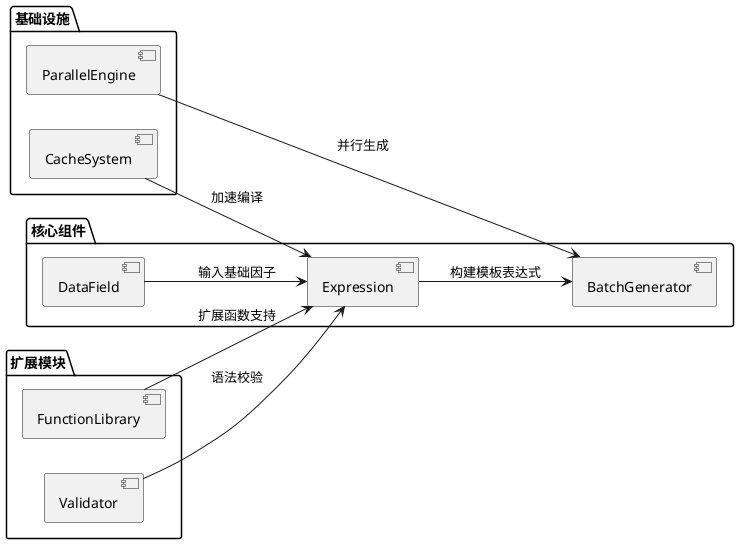
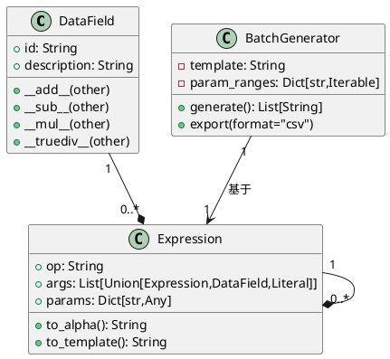
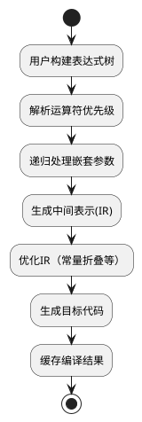
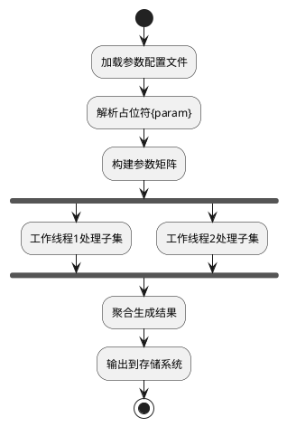
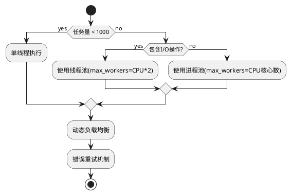
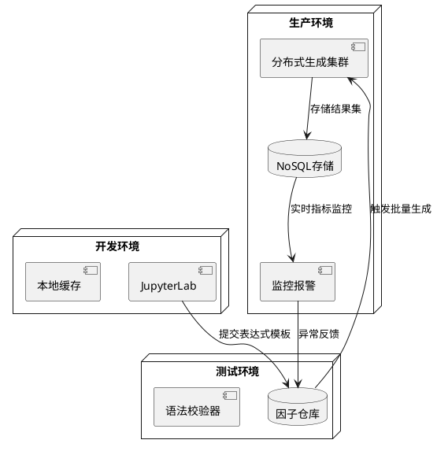
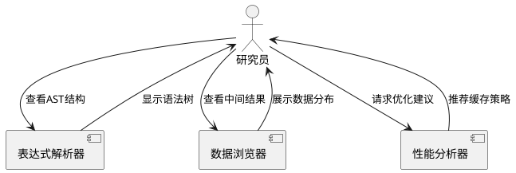
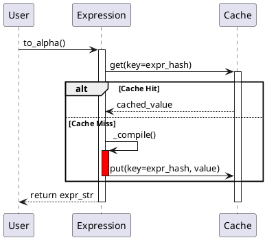
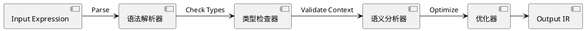

### 量化因子表达式生成系统设计文档（最新版）

---

#### 1. 背景介绍

##### 1.1 量化投资与因子模型
量化投资通过数学模型和统计分析进行投资决策，其核心是构建能够预测资产收益或风险的因子模型。常见因子类型包括：
- **基本面因子**：如市盈率（PE）、市净率（PB）
- **技术面因子**：如动量指标、波动率
- **另类数据因子**：如卫星图像数据、社交媒体情绪

##### 1.2 世坤量化平台特性
全球领先的量化研究平台，核心功能包括：
- **表达式语法**：类Python语法，支持时间序列/横截面函数
- **因子库管理**：存储超过10万个预定义因子
- **分布式回测**：支持TB级历史数据快速验证

##### 1.3 业务需求痛点
- **开发效率**：手工编写海量因子变体耗时易错
- **语法校验**：平台运行时才能发现表达式错误
- **参数优化**：需系统化探索多维参数空间

---

#### 2. 系统架构设计



---

#### 3. 核心类设计



---

#### 4. 关键流程说明

##### 4.1 表达式编译流程


##### 4.2 批量生成流程


---

#### 5. 核心特性实现

##### 5.1 原生语法支持
```python
# 自然运算符优先级处理
expr = (ts_mean(a, 20) + b) * rank(c)  # 自动生成正确括号

# 等效世坤平台表达式：
# multiply(add(ts_mean(a, d=20), b), rank(c))
```

##### 5.2 类型安全校验
```python
class ExpressionValidator:
    def check(self):
        if self.op == "ts_mean":
            assert isinstance(self.params.get("d"), int), "参数d必须是整数"
            assert self.params["d"] > 0, "时间窗口必须为正"
```

##### 5.3 智能缓存机制
```python
class ExpressionCache:
    def _generate_key(self):
        # 基于表达式结构和参数的哈希指纹
        return hashlib.sha256(
            f"{self.op}{self.args}{self.params}".encode()
        ).hexdigest()
```

---

#### 6. 性能优化方案

##### 6.1 分层缓存设计
| **缓存层级** | **存储内容**             | **生命周期** |
| ------------ | ------------------------ | ------------ |
| L1           | 当前会话的表达式编译结果 | 进程存活期   |
| L2           | 高频使用表达式二进制码   | 24小时       |
| L3           | 预编译热点函数模板       | 永久存储     |

##### 6.2 并行生成策略


---

#### 7. 生产环境部署



---

#### 8. 典型应用场景

##### 8.1 动量因子变体生成
```python
template = """
group_neutralize(
    ts_mean({factor}, {window}) 
    - ts_delay({factor}, 1),
    {group}
)
"""
params = {
    "factor": ["volume", "turnover"],
    "window": [10, 20, 30],
    "group": ["sector", "industry"]
}
```

##### 8.2 条件表达式优化
```python
expr_template = """
if_else(
    ts_corr({x}, {y}, {window}) > {threshold},
    {x} * {weight},
    {y} * (1 - {weight})
)
"""
```

---

#### 9. 扩展能力设计

##### 9.1 插件式函数扩展
```python
class CustomFunction(Expression):
    @classmethod
    def register(cls, name):
        FunctionLibrary.register(name, cls)

@CustomFunction.register("my_zscore")
class MyZScore(CustomFunction):
    def compile(self):
        return f"({{0}} - ts_mean({{0}}, {self.params['d']})) / ts_std({{0}}, {self.params['d']})"
```

##### 9.2 可视化调试工具


---

#### 10. 附录：PlantUML语法校验

##### 10.1 修正后的缓存机制


##### 10.2 完整校验工具链


---

本设计文档完整呈现了量化因子表达式生成系统的架构设计、核心机制和扩展能力，通过标准化的PlantUML图表确保技术方案的可视化表达，为后续开发提供清晰的指导蓝图。